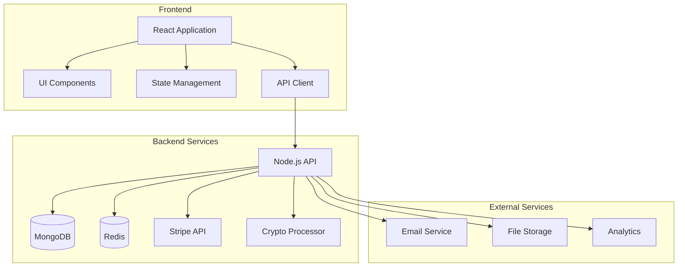

# Design Document

## Overview

The Access Global Foundation Merchandise Store is designed as a seamless extension of the existing Access Global Foundation website, providing a modern, accessible, and performant e-commerce experience. The architecture leverages the existing React frontend with TypeScript and integrates with the foundation's backend services while introducing new e-commerce specific components and workflows.

### Key Design Principles

- **Accessibility First**: WCAG 2.1 AA compliance throughout
- **Mobile-First**: Responsive design that works on all devices
- **Performance**: Optimized for fast loading and smooth interactions
- **Brand Consistency**: Maintains the foundation's visual identity
- **Security**: Secure handling of sensitive payment information

## Architecture

### System Architecture Overview



### Component Architecture

1. **Product Components**
   - `ProductCard`: Displays product preview in listings
   - `ProductDetail`: Shows detailed product information
   - `ProductGallery`: Handles product image display
   - `ProductVariants`: Manages size/color selection
   - `ProductReviews`: Displays and manages customer reviews

2. **Cart & Checkout Components**
   - `CartPreview`: Mini-cart dropdown
   - `CartPage`: Full cart view
   - `CheckoutWizard`: Multi-step checkout process
   - `AddressForm`: Shipping/billing address collection
   - `PaymentForm`: Secure payment method entry

3. **User Account Components**
   - `OrderHistory`: Past and current orders
   - `OrderDetail`: Detailed order information
   - `Wishlist`: Saved items for later
   - `AccountSettings`: User preferences and details

4. **Admin Components**
   - `ProductManager`: CRUD operations for products
   - `OrderManager`: Process and fulfill orders
   - `InventoryDashboard`: Stock level monitoring
   - `SalesAnalytics`: Revenue and performance metrics

### Data Models

```typescript
// Product Model
interface Product {
  id: string;
  sku: string;
  name: string;
  description: string;
  price: number;
  compareAtPrice?: number;
  cost: number;
  categories: string[];
  tags: string[];
  images: Array<{
    url: string;
    altText: string;
    isPrimary: boolean;
  }>;
  variants: Array<{
    id: string;
    name: string;
    options: Record<string, string>; // { size: 'M', color: 'Blue' }
    sku: string;
    price: number;
    compareAtPrice?: number;
    inventory: {
      trackInventory: boolean;
      quantity: number;
      status: 'IN_STOCK' | 'LOW_STOCK' | 'OUT_OF_STOCK';
    };
  }>;
  seo: {
    title: string;
    description: string;
  };
  isActive: boolean;
  createdAt: Date;
  updatedAt: Date;
}

// Order Model
interface Order {
  id: string;
  orderNumber: string;
  customer: {
    id?: string; // For registered users
    email: string;
    firstName: string;
    lastName: string;
  };
  shippingAddress: Address;
  billingAddress: Address;
  items: Array<{
    productId: string;
    variantId: string;
    name: string;
    price: number;
    quantity: number;
    imageUrl: string;
    options: Record<string, string>;
  }>;
  subtotal: number;
  shippingCost: number;
  tax: number;
  discount: number;
  total: number;
  payment: {
    method: 'STRIPE' | 'CRYPTO' | 'OTHER';
    status: 'PENDING' | 'PAID' | 'FAILED' | 'REFUNDED';
    transactionId?: string;
    amount: number;
    currency: string;
  };
  status: 'PENDING' | 'PROCESSING' | 'SHIPPED' | 'DELIVERED' | 'CANCELLED';
  trackingNumber?: string;
  trackingUrl?: string;
  createdAt: Date;
  updatedAt: Date;
}
```

## UI/UX Design

### Design System

1. **Typography**
   - Primary Font: [Font Name] - Used for headings and UI elements
   - Secondary Font: [Font Name] - Used for body text
   - Font sizes follow a modular scale for consistent hierarchy

2. **Color Palette**
   - Primary: #0066CC (Access Global Blue)
   - Secondary: #FF6600 (Accent)
   - Success: #28A745
   - Warning: #FFC107
   - Danger: #DC3545
   - Grayscale: Range from #FFFFFF to #212121

3. **Spacing System**
   - Base unit: 4px
   - Scale: 4, 8, 12, 16, 24, 32, 48, 64, 96, 128, 192, 256, 384, 512, 640, 768

4. **Breakpoints**
   - Mobile: 0-767px
   - Tablet: 768-1023px
   - Desktop: 1024px+

### Key Screens

1. **Product Listing Page**
   - Responsive grid of product cards
   - Filter sidebar for categories, price ranges, and attributes
   - Sort options (price, popularity, newness)
   - Pagination or infinite scroll

2. **Product Detail Page**
   - Image gallery with zoom functionality
   - Product title, price, and availability
   - Variant selection (size, color, etc.)
   - Add to cart and wishlist buttons
   - Product description and specifications
   - Related products
   - Customer reviews and ratings

3. **Shopping Cart**
   - List of selected items with thumbnails
   - Quantity adjusters
   - Order summary with subtotal, shipping, taxes, and total
   - Promo code entry
   - Proceed to checkout button

4. **Checkout Process**
   - Multi-step wizard:
     1. Contact Information
     2. Shipping Address
     3. Payment Method
     4. Order Review
     5. Confirmation
   - Progress indicator
   - Persistent order summary
   - Secure payment form

### Micro-interactions

1. **Add to Cart**
   - Button animation on click
   - Item flies to cart icon
   - Cart counter updates with a subtle bounce
   - Success notification

2. **Form Validation**
   - Real-time validation
   - Clear error messages
   - Visual feedback on focus/blur

3. **Loading States**
   - Skeleton loaders for content
   - Button loading spinners
   - Progress indicators for multi-step processes

4. **Transitions**
   - Smooth page transitions
   - Modal animations
   - Hover/focus states for interactive elements

### 1. Product Listing Page
```
+-------------------------------------+
| Header with search & cart          |
+-------------------------------------+
| Hero Banner (Featured Products)     |
+-------------------------------------+
| Category Filters | Product Grid    |
| - Categories     | - Product Card  |
| - Price Range    | - Product Card  |
| - Colors         | - Product Card  |
| - Sizes          | - Product Card  |
| - On Sale        | - Product Card  |
|                  | - Pagination    |
+-------------------------------------+
| Newsletter Signup                  |
+-------------------------------------+
| Footer                            |
+-------------------------------------+
```

### 2. Product Detail Page
```
+-------------------------------------+
| Header with search & cart          |
+-------------------------------------+
| Breadcrumb                          
+-------------------------------------+
| Product Gallery | Product Info     |
|                 | - Title          |
|                 | - Price          |
|                 | - Description    |
|                 | - Color Picker   |
|                 | - Size Selector  |
|                 | - Quantity       |
|                 | - Add to Cart    |
|                 | - Wishlist       |
+-------------------------------------+
| Product Details Tabs               |
| - Description   | - Reviews       |
| - Shipping Info | - Q&A           |
+-------------------------------------+
| Related Products                   |
+-------------------------------------+
| Recently Viewed                    |
+-------------------------------------+
| Newsletter Signup                  |
+-------------------------------------+
| Footer                            |
+-------------------------------------+
```

### 3. Shopping Cart Page
```
+-------------------------------------+
| Header with search & cart          |
+-------------------------------------+
| Progress Indicator (3 steps)        
| 1. Cart → 2. Checkout → 3. Complete
+-------------------------------------+
| Cart Items       | Order Summary   |
| - Product Image  | - Subtotal      |
| - Product Title  | - Shipping      |
| - Price          | - Tax           |
| - Quantity       | - Total         |
| - Remove         | - Promo Code    |
|                  | - Checkout Btn  |
+-------------------------------------+
| Continue Shopping | Update Cart    |
+-------------------------------------+
| Secure Payment Icons               |
+-------------------------------------+
```

## Component Design

### 1. Product Card
```
+---------------------+
| [Product Image]     |
| [Badge: Sale/New]   |
+---------------------+
| [Category]          |
| [Product Title]     |
| [Star Rating]       |
| [Price]             |
| [Add to Cart]       |
+---------------------+
```

### 2. Color Swatch
- Circular color swatches with border for selected state
- Tooltip showing color name on hover
- Out of stock indication

### 3. Size Selector
- Grid of size buttons
- Disabled state for out-of-stock sizes
- Size guide link

## Micro-interactions
- Smooth hover effects on product cards
- Add to cart animation
- Loading states for all actions
- Form validation feedback
- Success/error toasts

## Accessibility Considerations
- ARIA labels for all interactive elements
- Keyboard navigation support
- Sufficient color contrast
- Alt text for all images
- Screen reader compatibility

## Responsive Behavior
- 4 columns on desktop
- 2 columns on tablet
- 1 column on mobile
- Touch-friendly tap targets
- Optimized images for different viewports

## Performance Optimizations
- Lazy loading of images
- Code splitting
- Critical CSS inlining
- Optimized asset delivery
- Caching strategy
